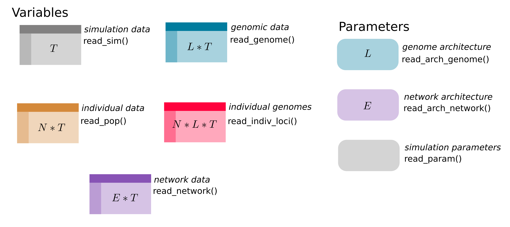

# speciomer

R package to read the output of [speciome](https://github.com/rscherrer/speciome).

<!-- badges: start -->
[](https://github.com/rscherrer/speciomer/actions)
<!-- badges: end -->

## Prerequisites

* [R](https://rstudio-education.github.io/hopr/starting.html) version 3.6.3 or higher
* (optional) [RStudio](https://rstudio-education.github.io/hopr/starting.html)

## Install

From within R, use

```r
install.packages("devtools") # to install devtools
devtools::install_github("rscherrer/speciomer", build_vignettes = TRUE) # install and build the vignette
```

## Use

Usage is exemplified in the vignette. View the vignette in your browser by typing, in R:

```r
browseVignettes("speciomer")
```

and clicking on the HTML link.

The purpose of the package is to produce tibbles (a type of table in R) from raw simulation data. The tibbles can be of different dimensions depending on the data they record. Here we outline the different tibbles that can be produced for a given simulation, which function to use for each of them as well as their dimensions:



where *T* is the number of time points, *N* is the number of individuals, *L* is the number of loci and *E* is the number of edges. Note that the number of individuals can change from one time point to the next, our usage of a seemingly constant *N* here is only for illustratory purpose.

## Permissions

Copyright (c) Raphael Scherrer, 2023 (open source license will be added upon publication).